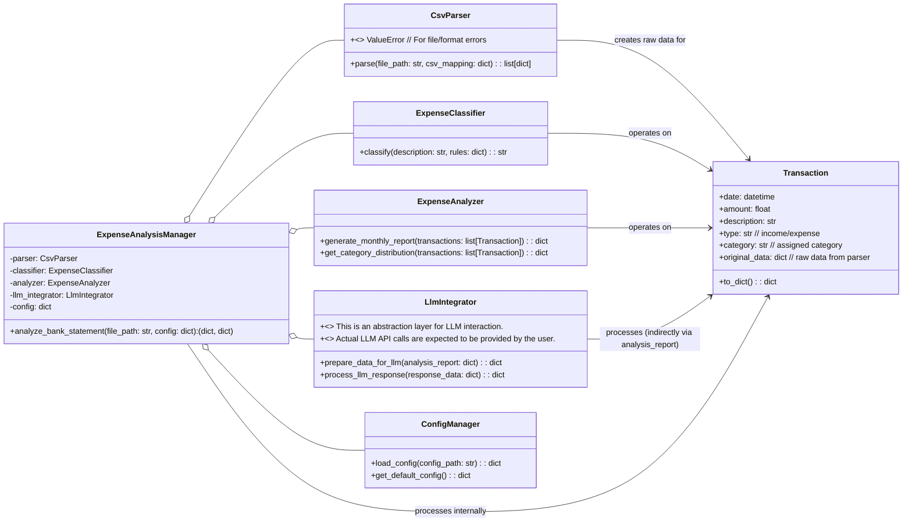

## LLD (低级设计文档) - 最终版

### 项目名(包名)规范

`expenditure_analyse`

### 版本号与更新

**初始版本：V1.0**

### 1. 模块设计

本包将主要分为以下几个核心模块：

*   `core`: 核心数据模型（`Transaction`类）和基础工具函数。
*   `parser`: CSV文件解析和原始数据提取。
*   `classifier`: 消费分类逻辑和规则管理。
*   `analyzer`: 月度花销统计和报告生成。
*   `llm_integrator`: 大模型数据接口和结果处理的抽象层。
*   `config`: 配置管理工具。
*   `main`: 提供高层级的API接口（门面），协调各个模块。

### 2. UML 设计

#### 2.1 类图



**设计模式考虑：**

*   **门面模式 (Facade Pattern):** `ExpenseAnalysisManager` 作为整个包的门面，提供简化的接口给外部调用者，内部协调各个子系统 (`CsvParser`, `ExpenseClassifier`, `ExpenseAnalyzer`, `LlmIntegrator`) 的工作。
*   **策略模式 (Strategy Pattern):** 在 `ExpenseClassifier` 中隐式存在，通过传入不同的 `rules` 字典实现不同的分类策略。未来可以显式化为不同的分类器类。

### 3. 数据模型

#### 3.1 `Transaction` 类

用于封装单笔交易的结构化数据。

```python
# expenditure_analyse/core.py
from datetime import datetime

class Transaction:
    def __init__(self, date: datetime, amount: float, description: str,
                 transaction_type: str, category: str = "Uncategorized",
                 original_data: dict = None):
        if not isinstance(date, datetime):
            raise ValueError("Date must be a datetime object.")
        if not isinstance(amount, (int, float)):
            raise ValueError("Amount must be a number.")
        if transaction_type not in ["income", "expense"]:
            raise ValueError("Transaction type must be 'income' or 'expense'.")
        if amount < 0: # 统一存储为正数，通过type字段区分
            amount = abs(amount)

        self.date = date
        self.amount = amount
        self.description = description
        self.type = transaction_type  # 'income' or 'expense'
        self.category = category
        self.original_data = original_data if original_data is not None else {}

    def __repr__(self):
        return (f"Transaction(date={self.date.strftime('%Y-%m-%d')}, "
                f"amount={self.amount:.2f}, type='{self.type}', "
                f"category='{self.category}', desc='{self.description[:30]}...')")

    def to_dict(self):
        return {
            "date": self.date.isoformat(),
            "amount": self.amount,
            "description": self.description,
            "type": self.type,
            "category": self.category,
            "original_data": self.original_data
        }
```

### 4. 示例内容

#### 4.1 `bank_statement_sample.csv` (示例银行流水CSV文件)

```csv
日期,交易时间,交易金额,余额,交易类型,交易描述,对方账户名,备注
2023-10-01,10:00:00,-50.00,1950.00,支出,午餐_外卖,饿了么,
2023-10-01,15:30:00,-15.00,1935.00,支出,公交卡充值,公共交通,
2023-10-02,08:00:00,-120.00,1815.00,支出,超市购物_日常用品,沃尔玛,
2023-10-02,18:00:00,-88.50,1726.50,支出,晚餐_火锅,海底捞,
2023-10-03,09:30:00,200.00,1926.50,收入,工资_兼职,ABC公司,
2023-10-03,14:00:00,-35.00,1891.50,支出,咖啡,星巴克,
2023-10-04,11:00:00,-250.00,1641.50,支出,网购_电子产品,京东,
2023-10-05,20:00:00,-60.00,1581.50,支出,电影票_娱乐,万达影院,
```

#### 4.2 Python 使用示例

```python
# main.py (用户使用入口)
import os
from expenditure_analyse.main import ExpenseAnalysisManager

# 1. 定义或加载配置
config = {
    "csv_mapping": {
        "date_col": "日期",
        "amount_col": "交易金额",
        "description_col": "交易描述",
        "type_col": "交易类型",
        "income_keyword": "收入",
        "expense_keyword": "支出"
    },
    "classification_rules": {
        "餐饮": ["午餐", "晚餐", "外卖", "火锅", "咖啡", "餐"],
        "交通": ["公交", "地铁", "打车", "出行", "交通卡"],
        "购物": ["超市", "网购", "日用", "百货", "电子产品"],
        "娱乐": ["电影", "KTV", "游戏", "娱乐", "影院"],
        "收入": ["工资", "兼职", "利息"]
    },
    # V1.0 LLM 配置仅作为占位符，不实际调用
    "llm_config": {
        "api_key_env_var": "YOUR_LLM_API_KEY", # 实际使用时替换为你的LLM API Key
        "model_name": "gpt-3.5-turbo",
        "base_url": "https://api.openai.com/v1"
    }
}

# 实例化分析管理器
manager = ExpenseAnalysisManager(config)

# 2. 指定银行流水文件路径
csv_file_path = "bank_statement_sample.csv"

# 创建一个虚拟的CSV文件，用于示例运行
if not os.path.exists(csv_file_path):
    with open(csv_file_path, "w", encoding="utf-8") as f:
        f.write("""日期,交易时间,交易金额,余额,交易类型,交易描述,对方账户名,备注
2023-10-01,10:00:00,-50.00,1950.00,支出,午餐_外卖,饿了么,
2023-10-01,15:30:00,-15.00,1935.00,支出,公交卡充值,公共交通,
2023-10-02,08:00:00,-120.00,1815.00,支出,超市购物_日常用品,沃尔玛,
2023-10-02,18:00:00,-88.50,1726.50,支出,晚餐_火锅,海底捞,
2023-10-03,09:30:00,200.00,1926.50,收入,工资_兼职,ABC公司,
2023-10-03,14:00:00,-35.00,1891.50,支出,咖啡,星巴克,
2023-10-04,11:00:00,-250.00,1641.50,支出,网购_电子产品,京东,
2023-10-05,20:00:00,-60.00,1581.50,支出,电影票_娱乐,万达影院,
""")
    print(f"Created dummy CSV file: {csv_file_path}")

# 3. 执行分析
print(f"正在分析文件: {csv_file_path}...")
try:
    monthly_report, llm_insights = manager.analyze_bank_statement(csv_file_path)

    # 4. 打印分析结果和来自大模型的洞察
    print("\n--- 月度花销报告 ---")
    print(f"总收入: {monthly_report['total_income']:.2f} 元")
    print(f"总支出: {monthly_report['total_expense']:.2f} 元")
    print(f"净结余: {monthly_report['net_balance']:.2f} 元")

    print("\n--- 支出类别分布 ---")
    for category, details in monthly_report['expense_by_category'].items():
        print(f"- {category}: {details['amount']:.2f} 元 ({details['percentage']:.2f}%)")

    print("\n--- 大模型消费洞察与建议 (V1.0为模拟输出) ---")
    if llm_insights:
        print(f"行为洞察: {llm_insights.get('llm_advice', '（未提供具体建议，请检查LLM配置）')}")
        print(f"消费预测: {llm_insights.get('llm_prediction', '（未提供具体预测，请检查LLM配置）')}")
    else:
        print("（大模型集成模块尚未配置或返回结果）")

except ValueError as e:
    print(f"分析失败: {e}")
except Exception as e:
    print(f"发生未知错误: {e}")

finally:
    # 清理示例文件 (可选)
    # if os.path.exists(csv_file_path):
    #     os.remove(csv_file_path)
    pass
```

### 5. 测试代码

我们将使用 `pytest` 作为测试框架。所有测试文件将放置在 `tests/` 目录下。

#### 5.1 `tests/test_csv_parser.py`

```python
# expenditure_analyse/tests/test_csv_parser.py
import os
import pytest
from expenditure_analyse.parser import CsvParser

@pytest.fixture
def sample_csv_path(tmp_path):
    """创建临时CSV文件供测试使用"""
    csv_content = """日期,交易时间,交易金额,余额,交易类型,交易描述,对方账户名,备注
2023-10-01,10:00:00,-50.00,1950.00,支出,午餐_外卖,饿了么,
2023-10-02,08:00:00,100.00,2050.00,收入,兼职工资,ABC公司,
2023-10-03,09:00:00,-abc.00,1950.00,支出,错误金额,测试,
"""
    file_path = tmp_path / "test_bank_statement.csv"
    with open(file_path, "w", encoding="utf-8") as f:
        f.write(csv_content)
    return file_path

@pytest.fixture
def csv_config():
    return {
        "date_col": "日期",
        "amount_col": "交易金额",
        "description_col": "交易描述",
        "type_col": "交易类型",
        "income_keyword": "收入",
        "expense_keyword": "支出"
    }

def test_parse_csv_basic(sample_csv_path, csv_config):
    parser = CsvParser()
    transactions_data = parser.parse(sample_csv_path, csv_config)

    assert len(transactions_data) == 3 # 包含错误行，但应被解析出来
    assert transactions_data[0]["日期"] == "2023-10-01"
    assert transactions_data[0]["交易金额"] == "-50.00" # 保持原始字符串，后续转换
    assert transactions_data[0]["交易描述"] == "午餐_外卖"

    assert transactions_data[2]["交易金额"] == "-abc.00" # 错误金额也应被读取

def test_parse_csv_missing_column(sample_csv_path, csv_config):
    parser = CsvParser()
    modified_config = csv_config.copy()
    modified_config["date_col"] = "不存在的日期" # 故意设置一个不存在的列
    with pytest.raises(ValueError, match="Missing required column '不存在的日期' in CSV header."):
        parser.parse(sample_csv_path, modified_config)

def test_parse_csv_empty_file(tmp_path, csv_config):
    empty_file = tmp_path / "empty.csv"
    empty_file.write_text("")
    parser = CsvParser()
    with pytest.raises(ValueError, match="CSV file is empty or has no header."):
        parser.parse(empty_file, csv_config)

def test_parse_csv_non_existent_file(csv_config):
    parser = CsvParser()
    with pytest.raises(ValueError, match="File not found: non_existent.csv"):
        parser.parse("non_existent.csv", csv_config)
```

#### 5.2 `tests/test_expense_classifier.py`

```python
# expenditure_analyse/tests/test_expense_classifier.py
import pytest
from expenditure_analyse.classifier import ExpenseClassifier

@pytest.fixture
def classifier():
    return ExpenseClassifier()

@pytest.fixture
def classification_rules():
    return {
        "餐饮": ["午餐", "晚餐", "外卖", "咖啡", "餐"],
        "交通": ["公交", "地铁", "打车"],
        "购物": ["超市", "网购", "电子产品", "日用"],
        "娱乐": ["电影", "KTV"],
        "收入": ["工资", "兼职"] # 尽管是支出分类器，规则中也可以有收入关键词
    }

def test_classify_known_category(classifier, classification_rules):
    assert classifier.classify("午餐_外卖", classification_rules) == "餐饮"
    assert classifier.classify("打车去机场", classification_rules) == "交通"
    assert classifier.classify("京东网购了耳机", classification_rules) == "购物"
    assert classifier.classify("看电影", classification_rules) == "娱乐"
    assert classifier.classify("公司食堂午餐", classification_rules) == "餐饮"


def test_classify_case_insensitivity(classifier, classification_rules):
    assert classifier.classify("Coffee break", classification_rules) == "餐饮"
    assert classifier.classify("网购笔记本", classification_rules) == "购物"

def test_classify_unknown_category(classifier, classification_rules):
    assert classifier.classify("捐款", classification_rules) == "Uncategorized"
    assert classifier.classify("水电费", classification_rules) == "Uncategorized"
    assert classifier.classify("理财产品赎回", classification_rules) == "Uncategorized"


def test_classify_empty_description(classifier, classification_rules):
    assert classifier.classify("", classification_rules) == "Uncategorized"

def test_classify_with_no_rules(classifier):
    assert classifier.classify("随便什么", {}) == "Uncategorized"

def test_classify_with_complex_description(classifier, classification_rules):
    # 描述包含多个关键词，验证优先级或匹配逻辑
    assert classifier.classify("超市购物并吃午餐", classification_rules) == "购物" # 默认按第一个匹配到
    assert classifier.classify("买咖啡坐地铁", classification_rules) == "餐饮" # 默认按第一个匹配到

```

#### 5.3 `tests/test_expense_analyzer.py`

```python
# expenditure_analyse/tests/test_expense_analyzer.py
import pytest
from datetime import datetime
from expenditure_analyse.core import Transaction
from expenditure_analyse.analyzer import ExpenseAnalyzer

@pytest.fixture
def sample_transactions():
    return [
        Transaction(datetime(2023, 10, 1), 50.00, "午餐", "expense", "餐饮"),
        Transaction(datetime(2023, 10, 1), 150.00, "购物", "expense", "购物"),
        Transaction(datetime(2023, 10, 2), 200.00, "工资", "income", "收入"),
        Transaction(datetime(2023, 10, 2), 30.00, "咖啡", "expense", "餐饮"),
        Transaction(datetime(2023, 10, 3), 70.00, "娱乐", "expense", "娱乐"),
        Transaction(datetime(2023, 10, 3), 100.00, "奖金", "income", "收入"),
        Transaction(datetime(2023, 10, 4), 20.00, "公交", "expense", "交通"),
        Transaction(datetime(2023, 10, 5), 10.00, "未知消费", "expense", "Uncategorized"),
    ]

@pytest.fixture
def analyzer():
    return ExpenseAnalyzer()

def test_generate_monthly_report_totals(analyzer, sample_transactions):
    report = analyzer.generate_monthly_report(sample_transactions)

    assert report["total_income"] == 300.00
    assert report["total_expense"] == 330.00
    assert report["net_balance"] == -30.00

def test_generate_monthly_report_category_distribution(analyzer, sample_transactions):
    report = analyzer.generate_monthly_report(sample_transactions)
    expense_by_category = report["expense_by_category"]

    assert "餐饮" in expense_by_category
    assert expense_by_category["餐饮"]["amount"] == 80.00
    assert pytest.approx(expense_by_category["餐饮"]["percentage"]) == (80.00 / 330.00) * 100

    assert "购物" in expense_by_category
    assert expense_by_category["购物"]["amount"] == 150.00

    assert "娱乐" in expense_by_category
    assert expense_by_category["娱乐"]["amount"] == 70.00

    assert "交通" in expense_by_category
    assert expense_by_category["交通"]["amount"] == 20.00

    assert "Uncategorized" in expense_by_category
    assert expense_by_category["Uncategorized"]["amount"] == 10.00

    assert "收入" not in expense_by_category # 类别分布只针对支出

def test_generate_monthly_report_empty_transactions(analyzer):
    report = analyzer.generate_monthly_report([])
    assert report["total_income"] == 0.0
    assert report["total_expense"] == 0.0
    assert report["net_balance"] == 0.0
    assert report["expense_by_category"] == {}
```

### 6. Mock 数据

在示例代码中已经使用了 `bank_statement_sample.csv` 作为 mock 数据，以确保解析、分类和分析逻辑的正确性。对于大模型集成模块，由于 V1.0 不涉及实际调用，其 `prepare_data_for_llm` 和 `process_llm_response` 方法的测试将依赖于模拟的输入和预期输出。

```python
# expenditure_analyse/llm_integrator.py (部分代码)
class LlmIntegrator:
    def __init__(self, llm_config: dict = None):
        self.llm_config = llm_config if llm_config is not None else {}
        # V1.0 不实际调用，但可以基于配置进行一些验证或初始化

    def prepare_data_for_llm(self, analysis_report: dict) -> dict:
        """
        准备数据以发送给大模型。
        这里可以对analysis_report进行格式转换，例如转换为JSON字符串，
        或者提取关键指标，以便大模型更好地理解。
        """
        # 示例：简单地将报告转换为一个更适合LLM理解的prompt结构
        prompt_data = {
            "monthly_summary": {
                "total_expense": analysis_report.get("total_expense", 0),
                "total_income": analysis_report.get("total_income", 0),
                "net_balance": analysis_report.get("net_balance", 0)
            },
            "expense_breakdown": [
                {"category": k, "amount": v["amount"], "percentage": v["percentage"]}
                for k, v in analysis_report.get("expense_by_category", {}).items()
            ],
            "request_type": "expense_analysis_and_advice"
        }
        return prompt_data

    def process_llm_response(self, response_data: dict) -> dict:
        """
        处理大模型返回的响应数据。
        将大模型的自由文本或结构化输出转换为本项目内部可以使用的格式。
        V1.0 模拟返回结果。
        """
        # 假设LLM返回的JSON中包含 'advice' 和 'prediction' 字段
        # 在V1.0中，我们可以提供一个模拟的响应
        if not response_data: # 如果没有实际的LLM返回数据
             return {
                 "llm_advice": "（V1.0模拟建议：请注意您的消费习惯，以便更好地节流。）",
                 "llm_prediction": "（V1.0模拟预测：您的消费模式有望保持稳定。）"
             }

        advice = response_data.get("advice", "No specific advice provided by LLM.")
        prediction = response_data.get("prediction", "No specific prediction provided by LLM.")
        return {
            "llm_advice": advice,
            "llm_prediction": prediction
        }

# tests/test_llm_integrator.py (测试代码示例)
import pytest
from expenditure_analyse.llm_integrator import LlmIntegrator

def test_prepare_data_for_llm():
    integrator = LlmIntegrator()
    mock_report = {
        "total_income": 1000.0,
        "total_expense": 500.0,
        "net_balance": 500.0,
        "expense_by_category": {
            "餐饮": {"amount": 200.0, "percentage": 40.0},
            "购物": {"amount": 150.0, "percentage": 30.0},
            "娱乐": {"amount": 150.0, "percentage": 30.0}
        }
    }
    prepared_data = integrator.prepare_data_for_llm(mock_report)

    assert prepared_data["monthly_summary"]["total_expense"] == 500.0
    assert len(prepared_data["expense_breakdown"]) == 3
    assert prepared_data["request_type"] == "expense_analysis_and_advice"
    assert any(item['category'] == '餐饮' and item['amount'] == 200.0 for item in prepared_data['expense_breakdown'])

def test_process_llm_response_actual_data():
    integrator = LlmIntegrator()
    mock_llm_response = {
        "status": "success",
        "advice": "您的餐饮和娱乐支出占比较高，建议控制。",
        "prediction": "下月餐饮支出预计将增加5%。"
    }
    processed_insights = integrator.process_llm_response(mock_llm_response)

    assert processed_insights["llm_advice"] == "您的餐饮和娱乐支出占比较高，建议控制。"
    assert processed_insights["llm_prediction"] == "下月餐饮支出预计将增加5%。"

def test_process_llm_response_no_data_or_empty():
    integrator = LlmIntegrator()
    processed_insights_none = integrator.process_llm_response(None)
    assert "模拟建议" in processed_insights_none["llm_advice"]
    assert "模拟预测" in processed_insights_none["llm_prediction"]

    processed_insights_empty = integrator.process_llm_response({})
    assert processed_insights_empty["llm_advice"] == "No specific advice provided by LLM."
    assert processed_insights_empty["llm_prediction"] == "No specific prediction provided by LLM."
```
